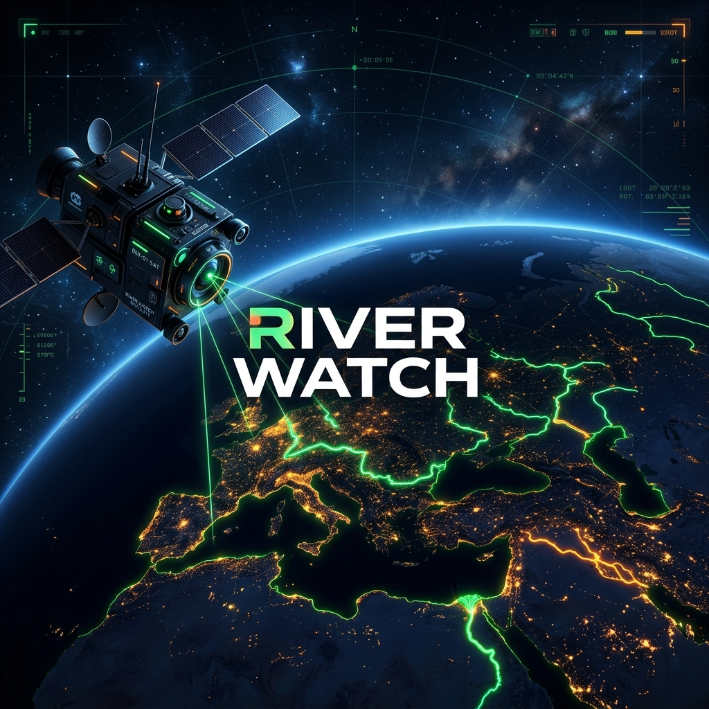
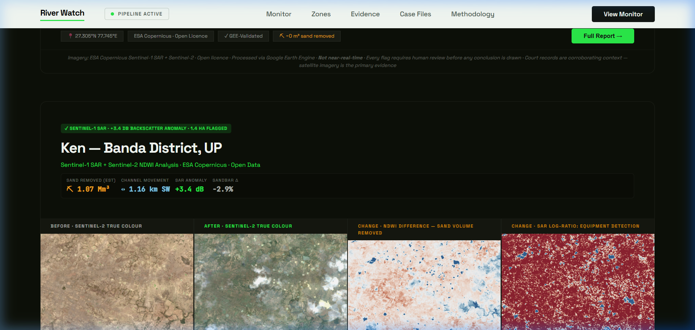
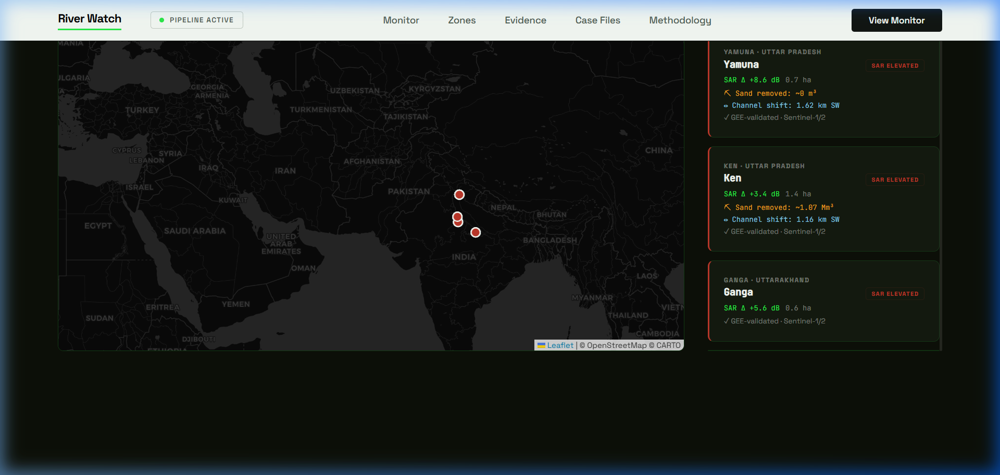
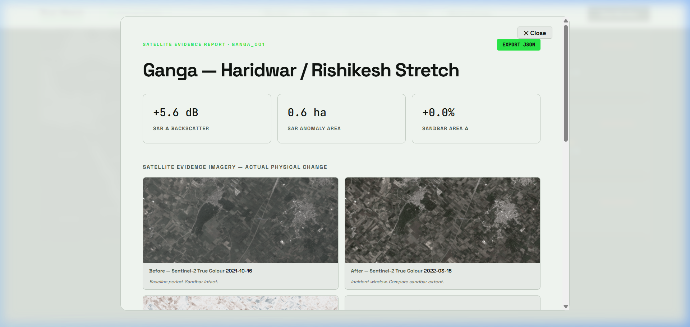

<div align="center">



# River Watch 🛰️

**A free, open, evidence-grade satellite monitoring tool for India's rivers.**

[](https://opensource.org/licenses/MIT)
[](https://www.python.org/downloads/)
[](https://earthengine.google.com/)
[](#app-demo)
[](#running-tests)

</div>

River Watch flags possible illegal sand mining activity along Indian river stretches using free Sentinel-1 (SAR radar) and Sentinel-2 (optical) satellite data. It surfaces dated, defensible *anomalies* — not "confirmed" illegal mining — for lawyers, journalists, NGOs, and communities to investigate and act on.

## App Demo

**Video Walkthrough**


**Dashboard Overview**


**Live Metrics View**


**Detailed Hotspot Analysis (Ganga)**


---

## ✨ What is Working (Phase 2)

| Feature | Status |
|---|---|
| 4 river hotspots monitored | Live |
| Sentinel-2 true-colour median composites | Local PNG |
| NDWI sandbar difference maps | Local PNG |
| Sentinel-1 SAR log-ratio change detection | Local PNG |
| Sand volume loss estimates (m3) | Computed |
| Riverbed channel shift (m) | Computed |
| 30-second auto-polling dashboard | Live |
| All 21 unit tests passing | Pass |

---

## Architecture

```
river-watch/
├── app_frontend/           # Static HTML/JS dashboard (served via http.server)
│   ├── index.html          # Single-page app entrypoint
│   ├── app.js              # All UI logic, polling, evidence rendering
│   ├── style.css           # Design system (dark mode, satellite aesthetic)
│   ├── imagery/            # GEE-generated PNGs (gitignored, regenerated by pipeline)
│   │   ├── chambal_001/    # 8 images per segment: before/after S2, NDWI, SAR, logratio
│   │   ├── yamuna_001/
│   │   ├── ken_001/
│   │   └── ganga_001/
│   ├── hero_img1.png       # Hero section inset images
│   └── hero_img2.png
│
├── pipeline/               # Core GEE satellite analysis modules
│   ├── gee_auth.py         # Earth Engine authentication (local + service account)
│   ├── sar_anomaly.py      # Signal 1: SAR backscatter log-ratio anomaly detection
│   ├── ndwi_baseline.py    # Signal 2: NDWI sandbar area measurement
│   ├── seasonal_baseline_builder.py  # Rolling 12-month baseline per segment
│   ├── anomaly_scorer.py   # Combines SAR + NDWI signals into anomaly level
│   ├── imagery_fetcher.py  # GEE thumbnail download utilities
│   └── export_evidence_card.py  # Evidence card (PDF/JSON) export
│
├── scripts/                # Orchestration scripts
│   ├── generate_dashboard_data.py  # MAIN pipeline: fetches imagery, computes metrics
│   ├── refresh_anomaly_cache.py   # Batch anomaly cache refresh
│   ├── backtest_case.py    # Validate pipeline against known incidents
│   ├── add_segment.py      # Add a new river segment
│   ├── batch_monitor.py    # Run monitoring across all segments
│   └── discover_segments.py # Auto-discover river segments from GeoJSONs
│
├── app/                    # Streamlit app (alternative interface)
│   ├── streamlit_app.py    # Landing page
│   ├── pages/
│   │   ├── 1_anomaly_watch.py
│   │   └── 2_case_files.py
│   └── components/
│
├── data/
│   ├── dashboard.json      # Generated by pipeline (gitignored)
│   ├── anomaly_cache.json  # Generated anomaly cache (gitignored)
│   ├── segments/           # River segment GeoJSONs (versioned)
│   ├── case_files/         # Verified case write-ups (versioned)
│   └── baselines/          # Seasonal baseline cache (gitignored)
│
└── tests/                  # Unit tests (21 passing)
```

---

## Quickstart

### Prerequisites
- Python 3.12+
- A Google Earth Engine account (free for non-commercial use): https://earthengine.google.com/
- Authenticate once: `earthengine authenticate`

### Installation
```bash
git clone <this-repo>
cd river-watch
python -m venv venv

# Windows:
venv\Scripts\activate
# macOS/Linux:
source venv/bin/activate

pip install -r requirements.txt
```

### Run the dashboard (two steps)

**Step 1 - Generate data and imagery (takes 5-8 minutes)**
```bash
python scripts/generate_dashboard_data.py
```
Output:
- `data/dashboard.json` - all metrics and image paths
- `app_frontend/imagery/<segment_id>/` - local PNGs (8 per segment)

**Step 2 - Serve the dashboard**
```bash
python -m http.server 8000
# Open: http://localhost:8000/app_frontend/
```

The dashboard auto-polls every 30 seconds. No manual refresh needed after a pipeline run.

---

## Satellite Evidence Explained

### Signal 1 — SAR Backscatter Log-Ratio
Sentinel-1 C-band SAR works through clouds and at night. Metal equipment (dredgers, JCBs, trucks) creates strong radar returns on quiet sand. Method: `10 * log10(incident / baseline)` per pixel. Flag threshold: +3 dB.

### Signal 2 — NDWI Sandbar Area
NDWI = (Green - NIR) / (Green + NIR). Measures exposed sandbar area in baseline vs. incident window. Reduction indicates physical sand removal. Volume estimate = area_reduction x 1.5m assumed depth (conservative lower bound).

### Signal 3 — NDWI Difference Map
Red/orange = sandbar area increased (sand was extracted). Blue = water gained (natural monsoon pattern).

### AOI Framing
All images use a 5km x 5km bounding box centered on the exact hotspot lat/lon. Uses `.median()` compositing to eliminate cloud gaps and swath cutoffs.

---

## Critical Guardrails

1. Never show "confirmed illegal" anywhere
2. Never claim live/real-time data
3. Never fabricate SAR numbers — show "Awaiting GEE run" if not computed
4. Never compare dry-season before to monsoon after without seasonal adjustment
5. Every anomaly flag requires human review before legal/journalistic action

---

## Monitored Hotspots

| ID | River | Location | Incident Period | Reference |
|---|---|---|---|---|
| chambal_001 | Chambal | Dholpur / Morena, Rajasthan/MP | Dec 2022 - Jan 2023 | NGT Order 6 Feb 2023 |
| yamuna_001 | Yamuna | Agra / Mathura, UP | May - Jun 2021 | NGT OA 593/2017 |
| ken_001 | Ken | Banda District, UP/MP | Aug - Sep 2022 | NGT 448/2019 |
| ganga_001 | Ganga | Haridwar / Rishikesh, Uttarakhand | Mar - Apr 2022 | Supreme Court Suo Motu 2022 |

---

## Running Tests

```bash
python -m pytest tests/ -v
# Expected: 21 passed
```

---

## License

Code: MIT
Satellite data: ESA Copernicus (Sentinel-1/2) - open licence, attribution required
River Watch is independent of and not affiliated with any government agency.
All anomaly flags are preliminary and require human investigation to confirm.
